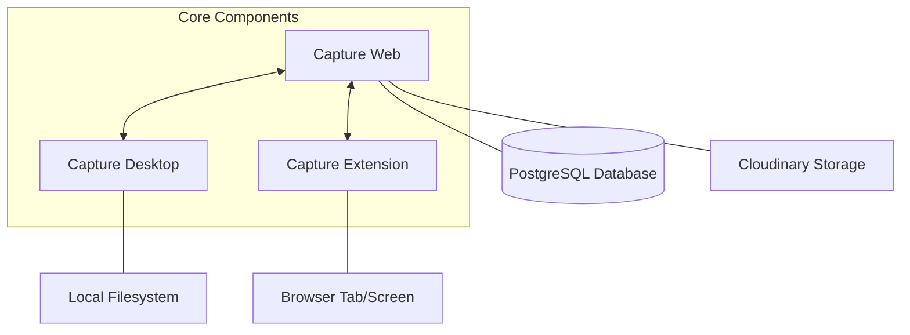

# Capture Screen Recorder 🎥

**Capture Screen Recorder** is a comprehensive, open-source screen recording suite designed to provide seamless recording experiences across the web, desktop, and browser. Whether you need a quick tab capture or a high-quality studio recording with system audio and hardware acceleration, Capture has you covered.

---

## 🏗️ Project Architecture

Capture consists of three primary components that work together to provide a unified recording ecosystem:

### 🛰️ The Trilogy

1.  **[Capture Web](./capture-web)**: The central hub. A Next.js application that handles user authentication, cloud storage, video transcoding, and AI-powered insights (transcripts, chapters).
2.  **[Capture Desktop](./capture-desktop)**: An Electron-powered power tool for deep system integration. It supports high-performance screen recording, webcam overlays, and system audio capture.
3.  **[Capture Extension](./capture-extension)**: A lightweight Chrome extension for instant recording within the browser. Perfect for quick demos and bug reports.

---

## ✨ Key Features

- **🚀 Versatile Recording**: Record your entire screen, specific windows, or browser tabs.
- **🎙️ Advanced Audio**: Capture system audio and microphone simultaneously.
- **☁️ Cloud Sync**: Automatically upload recordings to the web platform for easy sharing.
- **🤖 AI Insights**: Automatically generate transcripts and chapters for your videos.
- **🌓 Theme Support**: Beautiful Dark/Light modes across all applications.
- **🔒 Privacy First**: Fine-grained control over video visibility and data ownership.

---

## 🛠️ Technology Stack

- **Frontend**: React, Next.js, Tailwind CSS, Shadcn UI
- **Desktop**: Electron, Vite
- **Extension**: CRXJS, Chrome Web APIs
- **Backend**: Next.js API Routes, Inngest (Background Jobs)
- **Database**: PostgreSQL with Prisma ORM
- **Storage**: Cloudinary

---

## 🚦 Getting Started

To get started with the entire project, explore the documentation in each sub-directory:

- [Setup Capture Web](./capture-web/README.md)
- [Setup Capture Desktop](./capture-desktop/README.md)
- [Setup Capture Extension](./capture-extension/README.md)

### 📋 Prerequisites

- [Node.js](https://nodejs.org/) (v18+ recommended)
- [Bun](https://bun.sh/) (Optional, but recommended for faster installs)
- [PostgreSQL](https://www.postgresql.org/) (For the web platform)

---

## 🤝 Contributing

Contributions are what make the open-source community such an amazing place to learn, inspire, and create. Any contributions you make are **greatly appreciated**. Please see [`CONTRIBUTING.md`](./CONTRIBUTING.md) for more details.

## 📄 License

Distributed under the MIT License. See `LICENSE` for more information.

---

Built with ❤️ by [lwshakib](https://github.com/lwshakib)