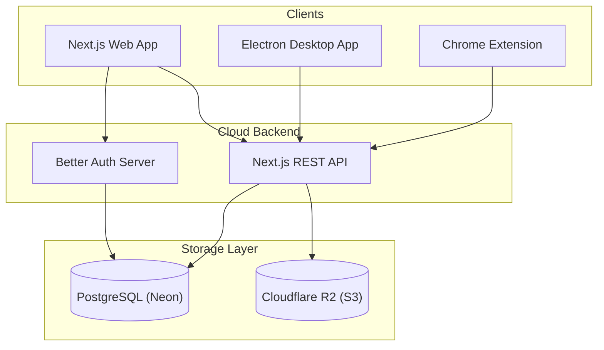
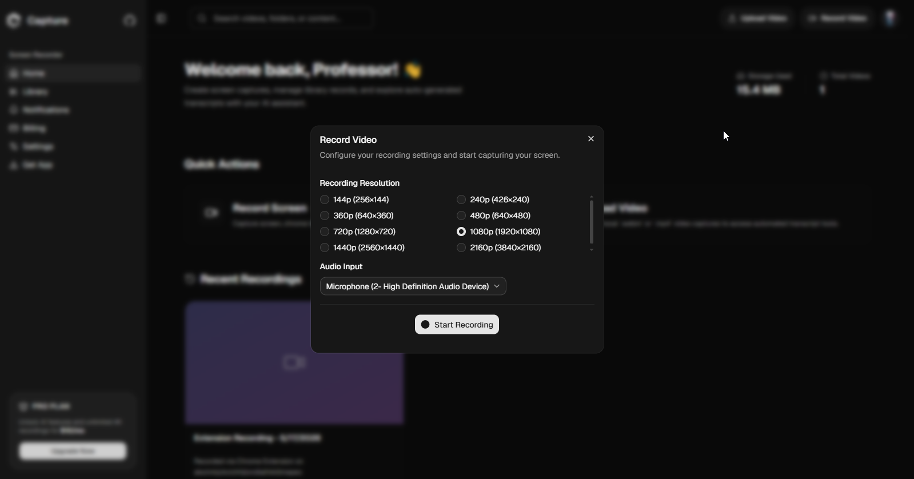
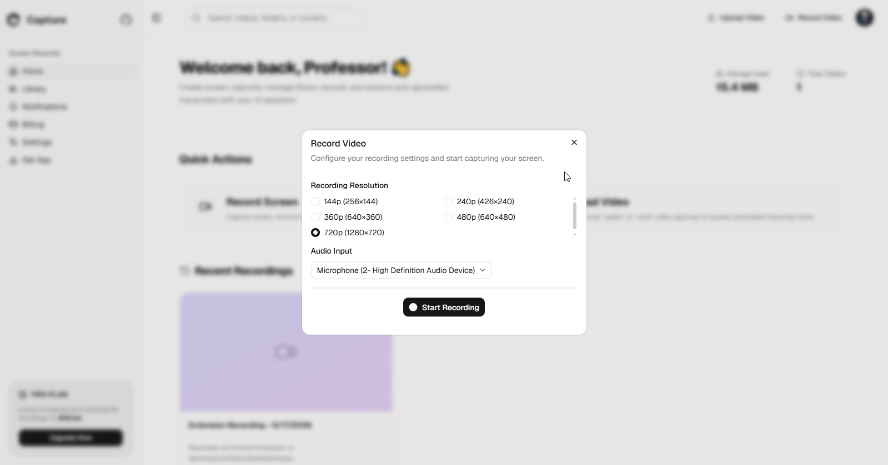
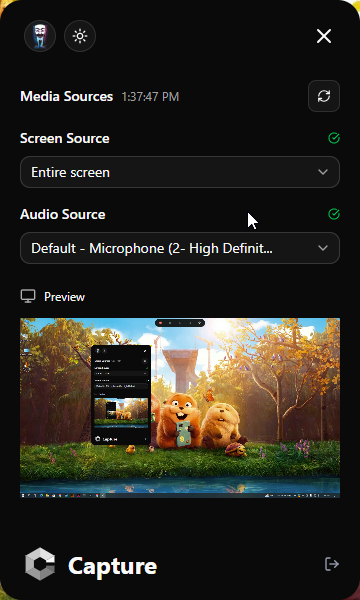
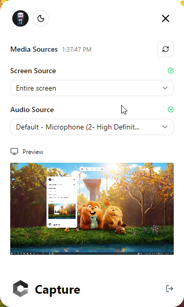
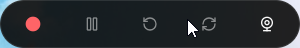
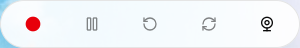
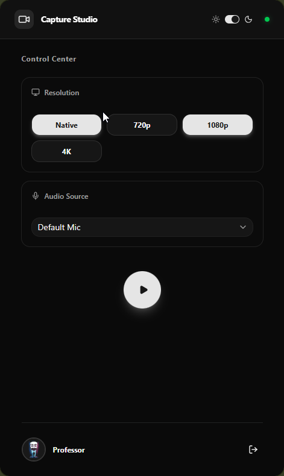
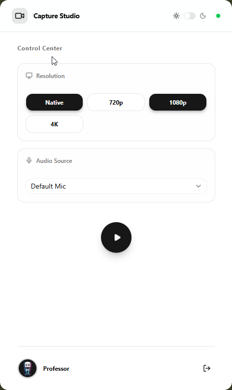

#  Capture Screen Recorder

<div align="left">
  <p><strong>A powerful, high-performance monorepo ecosystem for recording, syncing, and managing high-quality screen captures.</strong></p>
</div>

---

## 🚀 Overview

Capture Screen Recorder is an advanced, all-in-one screen recording suite. It features a central Web App cloud dashboard, a high-performance local Desktop App client, and a lightweight Chrome Extension. Capture anything, sync instantly to the cloud, and manage your recordings effortlessly.

---

## 📦 System Architecture

The following color-free architecture diagram charts how each of the client applications interface with the server handlers, Postgres database, and Cloudflare R2 cloud storage.


```mermaid
graph TD
    subgraph Clients
      Web["Next.js Web App"]
      Desktop["Electron Desktop App"]
      Extension["Chrome Extension"]
    end
    
    subgraph Cloud Backend
      Auth["Better Auth Server"]
      API["Next.js REST API"]
    end
    
    subgraph Storage Layer
      DB[("PostgreSQL (Neon)")]
      Bucket[("Cloudflare R2 (S3)")]
    end

    Web --> Auth
    Web --> API
    Desktop --> API
    Extension --> API

    Auth --> DB
    API --> DB
    API --> Bucket
```

---

## 📸 Application Demos

Here is a side-by-side view demonstrating the user interfaces across our dark and light modes:

| Application Target | Dark Mode | Light Mode |
| :--- | :---: | :---: |
| **Web Cloud Dashboard** <br> *Manage & stream all your recordings* |  |  |
| **Desktop Native App** <br> *Local high-performance capture client* |  |  |
| **Desktop Studio Controls** <br> *Sleek floating studio controls overlay* |  |  |
| **Chrome Extension Recorder** <br> *Browser tab & window instant capturer* |  |  |

---

## 🛠️ Monorepo Structures

This monorepo is managed by [Turborepo](https://turbo.build/) and strictly organized as follows:

- `apps/web`: Next.js 14 Web hub containing the UI, DB interactions, Better Auth integrations, and cloud media streaming APIs.
- `apps/desktop`: Native desktop application built using Electron, React, and Vite.
- `apps/chrome-extension`: Lightweight screen capture browser extension.
- `packages/ui`: Unified Shadcn/Tailwind React component package.
- `packages/eslint-config` & `packages/typescript-config`: Central linting and type-safety definitions.

---

## 💻 Getting Started & Installation

### Prerequisites
- Node.js (v20+)
- pnpm (v9+)
- PostgreSQL Database (Neon suggested)
- S3-compatible cloud storage (Cloudflare R2 suggested)

### Setup & Run

1. **Clone the Repository**
   ```bash
   git clone https://github.com/lwshakib/capture-screen-recorder.git
   cd capture-screen-recorder
   ```

2. **Install Package Dependencies**
   ```bash
   pnpm install
   ```

3. **Configure Environment Variables**
   Rename `apps/web/.env.example` to `apps/web/.env` and insert your database credentials:
   ```bash
   cp apps/web/.env.example apps/web/.env
   ```

4. **Initialize Database Schemas**
   Push the Prisma schemas directly to your PostgreSQL database:
   ```bash
   cd apps/web
   pnpm prisma db push
   cd ../..
   ```

5. **Run in Development Mode**
   Spin up all apps (Web, Desktop, Extension) concurrently with a single command:
   ```bash
   pnpm dev
   ```

6. **Build for Production**
   Compile and package all applications for release:
   ```bash
   pnpm build
   ```

---

## 🤝 Contributing

Please read [CONTRIBUTING.md](CONTRIBUTING.md) to learn how to fork, clone, set up upstream branches, develop safely, and submit pull requests to this ecosystem.

## 📄 License

MIT License. See LICENSE for details.
