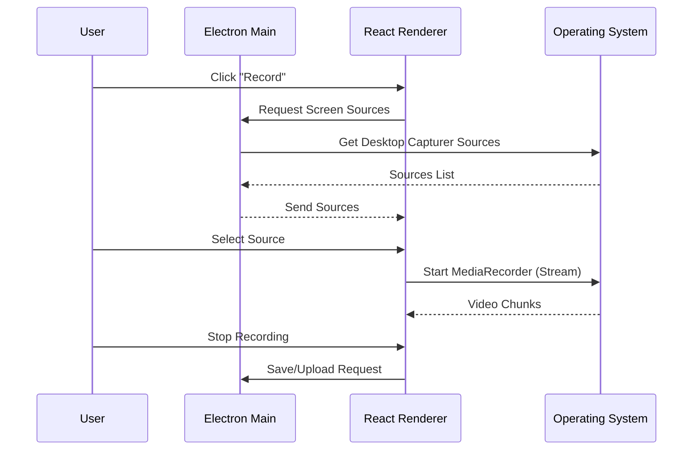

# Capture Desktop 💻

**Capture Desktop** is the professional-grade recording tool in the Capture ecosystem. Built with Electron, it offers deep system integration for high-quality screen, webcam, and audio recording.

---

## ✨ Features

- **📺 Full-Screen & Window Capture**: Record specific applications or your entire desktop.
- **📷 Webcam Overlay**: Seamlessly integrate your webcam into your recordings with customizable positioning.
- **🎙️ Dual Audio Recording**: Capture system audio (what you hear) and microphone audio (what you say) simultaneously.
- **⚡ Hardware Acceleration**: Optimized for low CPU usage during recording.
- **☁️ Direct Upload**: Quickly upload finished recordings to the [Capture Web](../capture-web) platform.
- **🖥️ Studio Mode**: Advanced recording interface with real-time previews.

---

## 🛠️ Technology Stack

- **Core**: [Electron](https://www.electronjs.org/)
- **Frontend**: [React](https://react.dev/) + [TypeScript](https://www.typescriptlang.org/)
- **Build Tool**: [Vite](https://vitejs.dev/)
- **Styling**: [Tailwind CSS](https://tailwindcss.com/) & [Shadcn UI](https://ui.shadcn.com/)
- **Icons**: [Lucide React](https://lucide.dev/)

---

## 🚦 Getting Started

### 1. Prerequisites
- [Node.js](https://nodejs.org/) (v18+)
- [Bun](https://bun.sh/) (Recommended)

### 2. Installation

```bash
cd capture-desktop
bun install
```

### 3. Development

To start the application in development mode:

```bash
bun run dev
```

### 4. Build

To build the application for production (generate executable):

```bash
# For Windows
bun run build:win

# For Mac
bun run build:mac

# For Linux
bun run build:linux
```

Examine `package.json` for specific build scripts.

---

## 📁 Project Structure

- `electron/`: Main process logic, IPC handlers, and system integration.
- `src/`: React frontend, studio views, and recording components.
- `src/components/`: Reusable UI components.
- `src/hooks/`: Custom hooks for system state and recording logic.

---

## 🏗️ Recording Flow



---

## 👤 Maintainer

Developed by [lwshakib](https://github.com/lwshakib)
