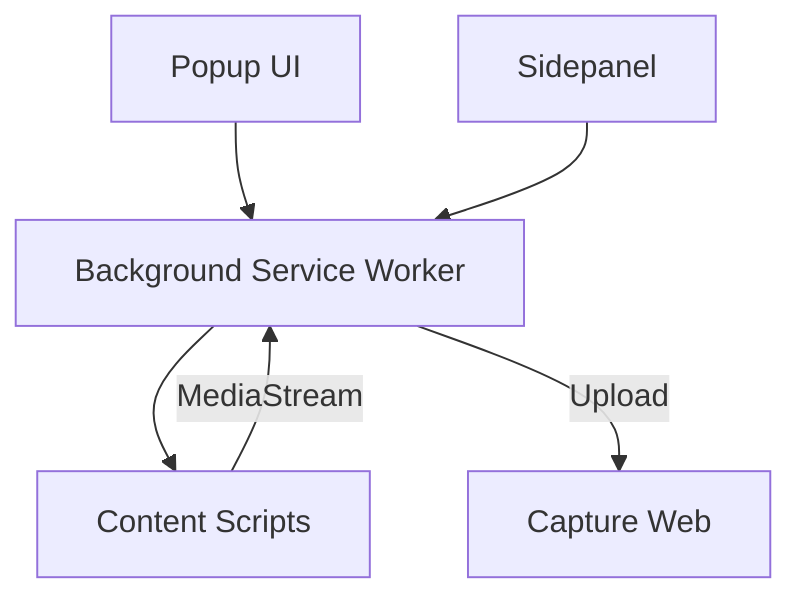

# Capture Extension 🧩

**Capture Extension** is a lightweight, browser-native recording tool for the Capture ecosystem. It allows you to quickly capture any browser tab or your desktop directly from Chrome.

---

## ✨ Features

- **🌐 Tab Recording**: Capture high-quality video of any browser tab.
- **🖥️ Desktop Capture**: Record your entire screen or specific windows.
- **🔘 Quick Access**: Launch recordings instantly from the extension popup.
- **サイドパネル Sidepanel Support**: Use the Chrome sidepanel for management while you record.
- **🚀 Seamless Integration**: Works with the [Capture Web](../capture-web) platform for easy sharing.

---

## 🛠️ Technology Stack

- **Framework**: [React](https://react.dev/) + [TypeScript](https://www.typescriptlang.org/)
- **Build Tool**: [Vite](https://vitejs.dev/) with [CRXJS](https://crxjs.dev/vite-plugin)
- **APIs**: Chrome Extension Manifest V3
- **Styling**: [Tailwind CSS](https://tailwindcss.com/)

---

## 🚦 Getting Started

### 1. Prerequisites
- [Node.js](https://nodejs.org/)
- [Bun](https://bun.sh/) (Optional)

### 2. Installation

```bash
cd capture-extension
bun install
```

### 3. Development

To start the development server with Hot Module Replacement (HMR):

```bash
bun run dev
```

### 4. How to Load in Chrome

1.  Open Chrome and navigate to `chrome://extensions/`.
2.  Enable **"Developer mode"** in the top right corner.
3.  Click **"Load unpacked"**.
4.  Select the `dist` folder generated inside the `capture-extension` directory.

### 5. Build for Production

```bash
bun run build
```

---

## 🏗️ Architecture



---

## 📁 Project Structure

- `src/popup/`: The main interface when clicking the extension icon.
- `src/background.ts`: Handles recording logic and communication between components.
- `src/content/`: Injected scripts for capturing media from web pages.
- `src/sidepanel/`: Sidepanel UI for persistent controls.
- `manifest.config.ts`: Configuration for Chrome Extension permissions and assets.

---

## 👤 Maintainer

Developed by [lwshakib](https://github.com/lwshakib)
