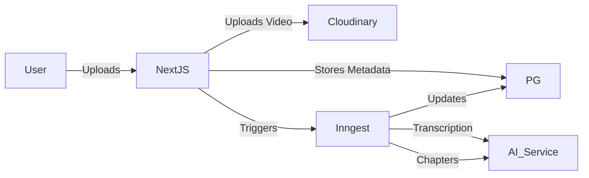

# Capture Web 🌐

**Capture Web** is the central management and hosting platform for the Capture Screen Recorder ecosystem. It provides a secure environment for storing, managing, and sharing your recordings with advanced AI features.

---

## ✨ Features

- **🔐 Robust Authentication**: Secure user login and session management powered by Better Auth.
- **📁 Video Management**: Organize, edit descriptions, and manage privacy settings for your recordings.
- **🤖 AI-Powered Analysis**:
  - Automatic transcription of video content.
  - Smart chapter generation for easy navigation.
  - AI-assisted chat for interacting with your video content.
- **🚀 High-Performance Streaming**: Optimized video delivery using Cloudinary and m3u8 streaming support.
- **📊 Real-time Background Jobs**: Inngest-powered workflow for processing videos, generating chapters, and subtitles asynchronously.

---

## 🛠️ Technology Stack

- **Framework**: [Next.js](https://nextjs.org/) (App Router)
- **Styling**: [Tailwind CSS](https://tailwindcss.com/) & [Shadcn UI](https://ui.shadcn.com/)
- **Database**: [PostgreSQL](https://www.postgresql.org/) with [Prisma ORM](https://www.prisma.io/)
- **Auth**: [Better Auth](https://better-auth.com)
- **Background Jobs**: [Inngest](https://www.inngest.com/)
- **Storage**: [Cloudinary](https://cloudinary.com/)
- **Runtime**: [Bun](https://bun.sh/)

---

## 🚦 Getting Started

### 1. Prerequisites
- Node.js / Bun
- PostgreSQL database
- Cloudinary Account
- Inngest Account (for background processing)

### 2. Installation

```bash
cd capture-web
bun install
```

### 3. Environment Variables

Create a `.env` file based on `.env.example` and fill in your credentials:

```env
DATABASE_URL="postgresql://..."
CLOUDINARY_CLOUD_NAME="..."
CLOUDINARY_API_KEY="..."
CLOUDINARY_API_SECRET="..."
NEXT_PUBLIC_APP_URL="http://localhost:3000"
# Add other required keys...
```

### 4. Database Setup

```bash
bunx prisma generate
bunx prisma db push
```

### 5. Running the App

```bash
bun dev
```

The application will be available at [http://localhost:3000](http://localhost:3000).

---

## 🏗️ Architecture



---

## 👤 Maintainer

Developed by [lwshakib](https://github.com/lwshakib)
